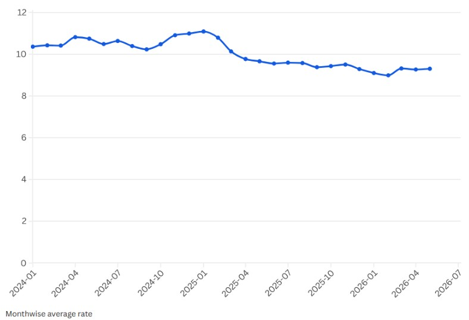
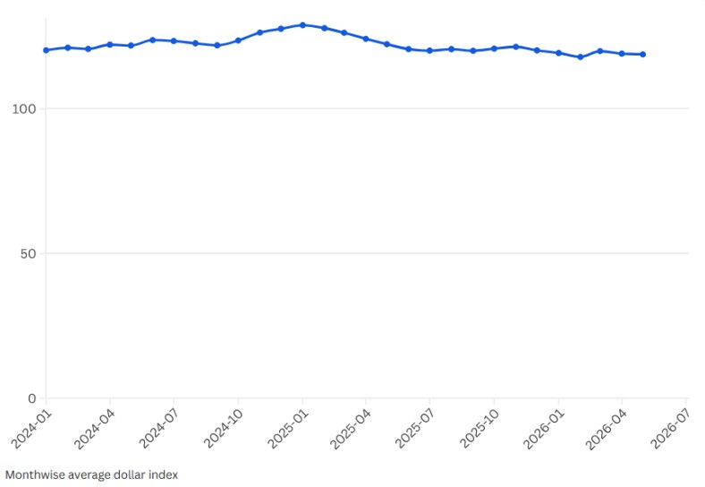
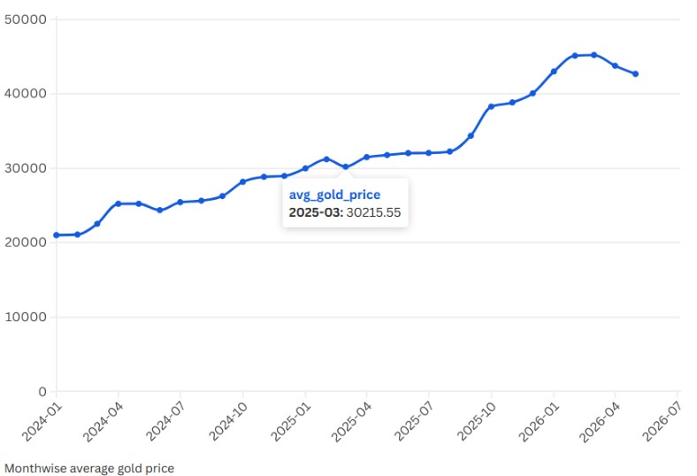

# Financial Market Insights with SQL

## Exploring relationship among Gold Price, US Dollar Index and USD/SEK Exchange Rate

This project uses **SQL** to explore the behaviour and relationships between **Gold Price, the US Dollar Index (DXY), and the USD/SEK exchange rate**.

Rather than asking only *"What happened?"*, the project gradually explores deeper questions about financial market movements:

- How did the three indicators move over time?
- Which one was the most volatile?
- How strongly were they related?
- Did previous-day values show any relationship with the following day's USD/SEK rate?
- Did the USD/SEK rate show any short-term continuation or reversal patterns?

The analysis is based on daily observations from **January 1, 2024 to May 31, 2026**.

---

# Project at a Glance

| Area | Details |
|---|---|
| **Tools** | SQL |
| **Data type** | Financial time-series data |
| **Period** | January 2024 – May 2026 |
| **Main variables** | Gold Price, Dollar Index, USD/SEK |
| **Main techniques** | JOINs, CTEs, Window Functions, Aggregation, Correlation, Conditional Probability |
| **Main focus** | Trends, volatility, relationships, lag effects, and short-term movement patterns |

---

# Data

The project uses three daily financial indicators.

## 1. Gold Price

### XAU/SEK — Gold Spot Swedish Krona

The variable `gold_price` represents the price of **one troy ounce of gold in Swedish kronor**.

**Source:** Investing.com

---

## 2. Dollar Index

### US Dollar Index — Nominal Broad Dollar Index

The variable `dollar_index` represents the broad value of the US dollar against a basket of currencies of major US trading partners.

**Source:** Federal Reserve — H.10 Statistical Release

---

## 3. USD/SEK Exchange Rate

### USD/SEK — Swedish Krona per US Dollar

The variable `rate` represents the number of Swedish kronor required to buy one US dollar.

**Source:** Federal Reserve Bank of St. Louis (FRED)

---

# Data Preparation

The three original datasets were stored separately:

```text
gold_price_table
dollar_index_table
rate_table
```

They were joined using their common date variable, `dt`, to create a unified dataset:

```text
market_data
│
├── dt
├── gold_price
├── dollar_index
└── rate
```

Each row therefore represents a common trading date with the corresponding Gold Price, Dollar Index, and USD/SEK exchange rate.

**SQL:** `00_joining.sql`

---

## Missing Values

Missing observations were handled before the main analysis.

Instead of removing observations, the missing values were estimated using the nearest available observations before and after the missing point.

The calculation was:

```text
Missing Value = (Previous Value + Following Value) / 2
```

If the immediately previous or following observation was also missing, the nearest available observation in that direction was used.

The first and last observations were kept unchanged if a required neighbouring value was unavailable.

The SQL implementation uses window functions such as `LAG()` and `LEAD()` together with `COALESCE()`.

**SQL:** `00_treating_missing_values.sql`

---

# Research Questions

The main analysis is organized around **10 questions**.

The questions progress from basic descriptive analysis to relationships, lag effects, and short-term probability patterns.

```text
Q1–Q2     Trend and volatility
              ↓
Q3–Q5     Correlation analysis
              ↓
Q6–Q7     Lag relationships
              ↓
Q8–Q10    Short-term movement patterns
```

---

# Q1. What is the month-wise trend of Gold Price, Dollar Index, and USD/SEK Rate?

The first step was to understand how the three financial indicators changed over the study period.

Monthly averages were calculated for:

- Gold Price
- Dollar Index
- USD/SEK exchange rate

**SQL:** `01_monthwise_average.sql`

The query groups the observations by month and calculates the average value of each indicator.

## Monthly Average USD/SEK Rate



## Monthly Average Dollar Index



## Monthly Average Gold Price



### Finding

The three indicators show noticeably different patterns over the study period.

- **Gold Price** shows a clear overall upward trend, despite short-term fluctuations.
- **Dollar Index** rises into early 2025 and then gradually declines.
- **USD/SEK** also shows a broadly declining pattern after early 2025.

These different movements provide motivation for investigating the relationships between the three variables more closely.

---

# Q2. What are the severe fluctuation dates, and which index is the most volatile?

The second question focuses on **daily volatility**.

Daily percentage changes were calculated for all three indicators.

A severe fluctuation was defined as:

```text
Absolute daily percentage change > 2%
```

**SQL:** `02_fluctuation.sql`

The analysis uses SQL window functions to compare each day's value with the previous day's value.

### Result

| Indicator | Relative Volatility |
|---|---|
| **Gold Price** | Highest |
| **USD/SEK** | Moderate |
| **Dollar Index** | Lowest |

### Finding

**Gold Price is the most volatile**, while the **Dollar Index is the most stable**.

USD/SEK falls between the two, showing moderate variability.

This suggests that gold experienced considerably larger day-to-day movements than the two dollar-related indicators.

---

# Q3. Is there a correlation between the Dollar Index and the USD/SEK exchange rate?

After examining the trends, the next question was whether the Dollar Index and USD/SEK are linearly related.

Pearson correlation was calculated directly in SQL.

**SQL:** `03_correlation_dollar_index_vs_rate.sql`

## Result

> **Pearson correlation = 0.77**

### Finding

A correlation of **0.77** indicates a strong positive linear association between the Dollar Index and the USD/SEK exchange rate.

In general, when the Dollar Index is higher, USD/SEK also tends to be higher.

However, because these are **time-series levels**, part of the relationship may reflect common trends over time and persistence in the series.

Therefore, the next question examines daily percentage changes.

---

# Q4. Is there a correlation between the percentage change in the Dollar Index and the percentage change in USD/SEK?

Raw time-series levels can sometimes produce strong relationships because both variables may move with time.

To focus more on **short-term movements**, daily percentage changes were calculated for both variables using `LAG()`.

**SQL:** `04_correlation_dollar_index_pct_change_vs_rate_pct_change.sql`

The SQL first calculates daily percentage changes and then measures their Pearson correlation.

## Result

> **Correlation = 0.81**

### Finding

The correlation of **0.81** indicates a strong positive relationship between the daily percentage changes of the Dollar Index and USD/SEK.

Within this dataset, days with an increase in the Dollar Index tend to coincide with increases in USD/SEK, and vice versa.

This result provides stronger evidence of short-term co-movement than the level correlation alone.

However:

> **Correlation does not imply causation.**

Both variables may respond simultaneously to other economic and financial factors.

---

# Q5. Is there a correlation between the percentage change in Gold Price and the percentage change in USD/SEK?

The same short-term analysis was applied to Gold Price.

Daily percentage changes in Gold Price and USD/SEK were calculated and compared using Pearson correlation.

**SQL:** `05_correlation_gold_pct_change_vs_rate_pct_change.sql`

## Result

> **Correlation = 0.08**

### Finding

A correlation of **0.08** indicates almost no linear relationship between the daily percentage changes in Gold Price and USD/SEK.

Unlike the Dollar Index, Gold Price does not appear to have a meaningful same-day linear relationship with USD/SEK in this dataset.

This suggests that their daily movements were largely unrelated in terms of a simple linear association during the study period.

However, this result does not rule out possible non-linear or delayed relationships.

---

# Q6. Does yesterday's Dollar Index have a relationship with today's USD/SEK rate?

The previous questions examined relationships occurring on the same day.

Here, I explored a possible **lead–lag relationship**:

> Does yesterday's Dollar Index have any relationship with today's USD/SEK rate?

The previous day's Dollar Index was obtained using the SQL `LAG()` function.

**SQL:** `06_lag_dollar_index_vs_rate.sql`

## Result

> **Lag correlation = 0.76**

### Finding

A lag correlation of **0.76** indicates a strong positive relationship between the previous day's Dollar Index and the current day's USD/SEK rate.

This suggests a possible lead–lag relationship in the data.

However, lag correlation represents **association**, not causation.

It also does not by itself establish that the Dollar Index can reliably forecast the following day's exchange rate.

---

# Q7. Does yesterday's Gold Price have a relationship with today's USD/SEK rate?

The same lag analysis was applied to Gold Price.

The question was:

> Does yesterday's Gold Price have any relationship with today's USD/SEK rate?

The previous day's Gold Price was obtained using `LAG()` and compared with the current USD/SEK rate.

**SQL:** `07_lag_gold_price_vs_rate.sql`

## Result

> **Lag correlation = -0.79**

### Finding

A lag correlation of **-0.79** indicates a strong negative relationship between the previous day's Gold Price and the current USD/SEK rate.

Within this dataset, higher Gold Price values on the previous day tend to be associated with lower USD/SEK values on the following day.

This is an interesting statistical relationship, but it should again be interpreted as **association rather than causation or proven predictive power**.

---

# Q8. What is the probability that USD/SEK increases on the second day, given that it increased on the first day?

Correlation describes relationships between variables, but it does not directly answer whether a movement tends to continue from one day to the next.

Therefore, the analysis was extended to **conditional probability**.

The question was:

> If USD/SEK increases today, how likely is it to increase again tomorrow?

**SQL:** `08_probability_2nd_day_increase.sql`

The SQL identifies increase days and uses `LEAD()` to examine the following day's movement.

## Result

> **P(Increase₂ | Increase₁) = 0.49**

### Finding

The probability is **0.49**, which is very close to 0.50.

This provides little evidence of a consistent one-day continuation pattern.

In other words, an increase in USD/SEK on one day does not appear to provide a meaningful advantage in predicting another increase on the following day.

---

# Q9. What is the probability that USD/SEK increases on the third day, given that it increased on the first two days?

The previous question considered one consecutive increase.

Here, the idea was extended:

> If USD/SEK has increased for two consecutive days, does that make a third increase more likely?

**SQL:** `09_probability_3rd_day_increase.sql`

The query constructs a three-day pattern using `LAG()` and identifies cases where the first two days both showed increases.

## Result

> **P(Increase₃ | Increase₁, Increase₂) = 0.50**

### Finding

The probability is **0.50**.

Even after two consecutive increases, there is no additional evidence of a strong continuation pattern.

This suggests that consecutive increases in USD/SEK do not provide a reliable short-term momentum signal in this dataset.

---

# Q10. What is the probability that USD/SEK changes in the opposite direction on the second day, given a large movement on the first day?

The final question looks at the opposite behaviour: **reversal**.

The question was:

> If USD/SEK experiences a large movement today, how likely is the following day's movement to be in the opposite direction?

A large movement was defined as:

```text
Absolute daily percentage change > 0.5%
```

**SQL:** `10_probability_reversal.sql`

The query identifies large movements and then uses `LEAD()` to examine whether the following day's movement has the opposite sign.

## Result

> **P(Reversal | Large Movement) = 0.55**

### Finding

The probability of a reversal is **0.55**, meaning that large movements were followed by an opposite movement slightly more often than not.

However, the probability is only slightly above 0.50.

Therefore, the evidence for a systematic reversal pattern is **weak** and should not be treated as a reliable prediction rule.

---

# Results Summary

The following table summarizes the main findings from all ten questions.

| # | Question | Result | Main Interpretation |
|---|---|---:|---|
| **Q1** | Month-wise trend | — | Gold ↑; Dollar Index & USD/SEK generally ↓ after early 2025 |
| **Q2** | Most volatile index | — | Gold most volatile; Dollar Index most stable |
| **Q3** | Dollar Index vs USD/SEK | **0.77** | Strong positive association |
| **Q4** | DXY % change vs USD/SEK % change | **0.81** | Strong positive short-term relationship |
| **Q5** | Gold % change vs USD/SEK % change | **0.08** | Almost no linear relationship |
| **Q6** | Previous-day DXY vs USD/SEK | **0.76** | Strong positive lagged association |
| **Q7** | Previous-day Gold vs USD/SEK | **−0.79** | Strong negative lagged association |
| **Q8** | P(Increase₂ \| Increase₁) | **0.49** | Little evidence of continuation |
| **Q9** | P(Increase₃ \| Increase₁, Increase₂) | **0.50** | No clear continuation pattern |
| **Q10** | P(Reversal \| Large Movement) | **0.55** | Weak tendency toward reversal |

---

# What Did the Analysis Reveal?

The results initially appear promising.

Several relationships are relatively strong:

```text
Dollar Index vs USD/SEK
Correlation = 0.77

DXY daily changes vs USD/SEK daily changes
Correlation = 0.81

Previous-day DXY vs USD/SEK
Correlation = 0.76

Previous-day Gold vs USD/SEK
Correlation = -0.79
```

However, when the analysis moves from **association toward short-term prediction**, the evidence becomes much weaker.

```text
P(Increase₂ | Increase₁)
= 0.49

P(Increase₃ | Increase₁, Increase₂)
= 0.50

P(Reversal | Large Movement)
= 0.55
```

These probabilities are all close to 0.50.

Therefore, the strong correlations found earlier do **not** automatically translate into reliable short-term forecasting signals.

---

# Statistical Perspective

This project highlights several important statistical ideas.

### Correlation is not causation

A strong correlation between the Dollar Index and USD/SEK does not establish that movements in the Dollar Index cause movements in USD/SEK.

### Levels and returns can tell different stories

The correlation between the levels of the Dollar Index and USD/SEK is **0.77**, while the correlation between their daily percentage changes is **0.81**.

Looking at changes helps focus more directly on short-term co-movement rather than simply comparing persistent time-series levels.

### Association is not prediction

A strong correlation does not necessarily mean that one variable can be used to predict another.

This becomes particularly clear when the conditional probabilities of continuation remain close to 0.50.

### Lag correlation is not causal forecasting

A strong lag correlation can indicate that two variables are related across time, but it does not prove that the earlier variable causes or reliably predicts the later one.

---

# Key Takeaway

The analysis reveals several interesting relationships among Gold Price, the Dollar Index, and USD/SEK.

The **Dollar Index and USD/SEK show a strong relationship**, both in their levels and especially in their daily percentage changes.

The lag analysis also reveals strong associations between previous-day values and the following day's USD/SEK rate.

However, the probability analysis tells a more cautious story.

A single day's increase does not make another increase particularly likely:

```text
P(Increase₂ | Increase₁) = 0.49
```

Even two consecutive increases do not provide a stronger continuation signal:

```text
P(Increase₃ | Increase₁, Increase₂) = 0.50
```

Large movements show only a weak tendency to reverse:

```text
P(Reversal | Large Movement) = 0.55
```

### Overall conclusion

> **Strong statistical associations do not necessarily translate into reliable forecasting strategies.**

The analysis therefore demonstrates both the usefulness and the limitations of simple statistical relationships in financial time-series data.

---

# SQL Techniques Used

This project demonstrates how SQL can be used for more than basic data retrieval.

## Data Preparation

- `JOIN`
- `CASE WHEN`
- `COALESCE()`
- Common Table Expressions (`CTE`)

## Time-Series Analysis

- `LAG()`
- `LEAD()`
- Daily percentage changes
- Monthly aggregation
- Lagged variables
- Consecutive-day patterns

## Statistical Analysis

- Pearson correlation
- Volatility analysis
- Conditional probability
- Reversal probability

---

# Limitations

This project is primarily an **exploratory time-series analysis**, not a complete exchange-rate forecasting model.

Some important limitations are:

- The study covers a limited period.
- Pearson correlation measures linear association only.
- Correlation does not imply causation.
- Lag correlation does not establish predictive causality.
- Only three financial indicators are included.
- No formal out-of-sample forecasting model was developed.
- The observed relationships may change across different time periods.

Therefore, the results should be interpreted as findings from this particular dataset and study period rather than as general rules for financial markets.

---

# Future Scope

There are several ways this project could be developed further.

Additional economic and financial variables could be incorporated, such as:

- Interest rates
- Inflation
- Crude oil prices
- Stock-market indices
- Central-bank policy decisions
- Economic announcements
- Geopolitical events

The expanded dataset could then be used for:

```text
Exploratory Analysis
        ↓
Feature Engineering
        ↓
Statistical Modelling
        ↓
Machine Learning
        ↓
Out-of-Sample Forecasting
```

This would allow the project to move from exploratory SQL analysis toward a more formal **financial forecasting and predictive analytics project**.

---

# Project Structure

```text
financial-market-insights-sql/
│
├── README.md
│
├── data/
│   └── README.md
│
├── sql/
│   ├── 00_joining.sql
│   ├── 00_treating_missing_values.sql
│   │
│   ├── 01_monthwise_average.sql
│   ├── 02_fluctuation.sql
│   ├── 03_correlation_dollar_index_vs_rate.sql
│   ├── 04_correlation_dollar_index_pct_change_vs_rate_pct_change.sql
│   ├── 05_correlation_gold_pct_change_vs_rate_pct_change.sql
│   ├── 06_lag_dollar_index_vs_rate.sql
│   ├── 07_lag_gold_price_vs_rate.sql
│   ├── 08_probability_2nd_day_increase.sql
│   ├── 09_probability_3rd_day_increase.sql
│   └── 10_probability_reversal.sql
│
├── graph/
│   ├── monthwise_average_rate.jpg
│   ├── monthwise_average_dollar_index.jpg
│   └── monthwise_average_gold_price.jpg
│
└── docs/
    └── project_report.pdf
```

---

# Data Sources

- [Investing.com — XAU/SEK Historical Data](https://www.investing.com/currencies/xau-sek-historical-data)
- [Federal Reserve — H.10 Foreign Exchange Rates](https://www.federalreserve.gov/datadownload/Choose.aspx?rel=H10)
- [FRED — USD/SEK Exchange Rate](https://fred.stlouisfed.org/series/DEXSDUS)

---

# Author

**Rahul Rehman**

MSc Statistics & Data Science

**Areas of interest:**

`SQL` · `Data Analytics` · `Financial Analytics` · `Statistics` · `Data Science` · `Business Intelligence`

---

## Disclaimer

This project is for educational and analytical purposes only.

The findings should not be interpreted as financial advice, investment advice, or a trading strategy.
